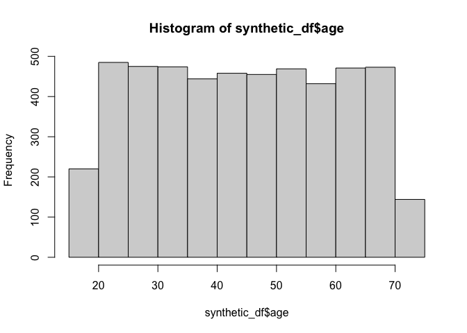
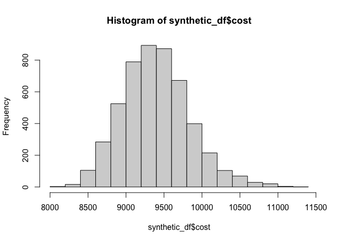

# Assignment2_DataAnalysis


## Project Summary & Instructions

EPI 203 Assignment 2. This project involves analyzing a synthetic
dataset with any prediction model.

### Instructions

Create a short R analysis of the cohort simulated data in a repository
on your GitHub account. Fork the repository and then edit to add your
analysis in a new branch. The analysis should include at least one table
describing the variables, a prediction algorithm (e.g., glm function,
caret package, etc.), at least one figure, and a brief summary of your
findings in the README.

## Data Cleaning

Data set: synthetic data

The csv file for `cohort` in the `raw-data` folder includes 5,000
observations with variables `smoke`, `female`, `age`, `cardiac`, and
`cost`.

``` r
library(tidyverse)
```

    ── Attaching core tidyverse packages ──────────────────────── tidyverse 2.0.0 ──
    ✔ dplyr     1.2.1     ✔ readr     2.2.0
    ✔ forcats   1.0.1     ✔ stringr   1.6.0
    ✔ ggplot2   4.0.2     ✔ tibble    3.3.1
    ✔ lubridate 1.9.5     ✔ tidyr     1.3.2
    ✔ purrr     1.2.2     
    ── Conflicts ────────────────────────────────────────── tidyverse_conflicts() ──
    ✖ dplyr::filter() masks stats::filter()
    ✖ dplyr::lag()    masks stats::lag()
    ℹ Use the conflicted package (<http://conflicted.r-lib.org/>) to force all conflicts to become errors

``` r
library(here)
```

    here() starts at /Users/tracychidyausiku/Coursework/epi/epi203/Assignment2

``` r
# load dataset
synthetic_df <- read_csv("/Users/tracychidyausiku/Coursework/epi/epi203/Assignment2/raw-data/cohort.csv")
```

    Rows: 5000 Columns: 5
    ── Column specification ────────────────────────────────────────────────────────
    Delimiter: ","
    dbl (5): smoke, female, age, cardiac, cost

    ℹ Use `spec()` to retrieve the full column specification for this data.
    ℹ Specify the column types or set `show_col_types = FALSE` to quiet this message.

``` r
head(synthetic_df)
```

    # A tibble: 6 × 5
      smoke female   age cardiac  cost
      <dbl>  <dbl> <dbl>   <dbl> <dbl>
    1     0      1    49       0  9542
    2     0      1    40       0  8849
    3     0      1    48       0  9233
    4     0      0    44       0  9507
    5     0      1    25       0  8585
    6     0      0    39       0  9507

``` r
# check for any missingness
sum(is.na(synthetic_df))
```

    [1] 0

``` r
# visualize distribution of continuous variables
hist(synthetic_df$age)
```



``` r
hist(synthetic_df$cost)
```



## Table 1

Purpose: Create a table with numeric description of variables

Binary Variables: female, cardiac, smoke

Continuous Variables: age, cost

``` r
library(table1)
```


    Attaching package: 'table1'

    The following objects are masked from 'package:base':

        units, units<-

``` r
# Make binary variables factors
synthetic_df$female <- factor(synthetic_df$female, levels=c(0,1), labels=c("Male", "Female"))
synthetic_df$smoke <- factor(synthetic_df$smoke, levels=c(0,1), labels=c("No Smoke", "Smoke"))
synthetic_df$cardiac <- factor(synthetic_df$cardiac, levels=c(0,1), labels=c("No Cardiac", "Cardiac"))

# Create table labels
label(synthetic_df$female) <- "Sex"
label(synthetic_df$smoke) <- "Smoke"
label(synthetic_df$cost) <- "Cost"
label(synthetic_df$age) <- "Age"

# create table 1
table1(~ cost + age + female + smoke | cardiac, data = synthetic_df)
```

                                   No Cardiac             Cardiac
    1                                (N=4725)             (N=275)
    2                 Cost                                       
    3            Mean (SD)         9350 (400)         10200 (427)
    4    Median [Min, Max] 9350 [8010, 10700] 10200 [9190, 11400]
    5                  Age                                       
    6            Mean (SD)        44.9 (15.7)         46.4 (16.2)
    7    Median [Min, Max]  45.0 [18.0, 72.0]   47.0 [18.0, 72.0]
    8                  Sex                                       
    9                 Male       1892 (40.0%)         242 (88.0%)
    10              Female       2833 (60.0%)          33 (12.0%)
    11               Smoke                                       
    12            No.Smoke       4212 (89.1%)         142 (51.6%)
    13             Smoke.1        513 (10.9%)         133 (48.4%)
                  Overall
    1            (N=5000)
    2                    
    3          9400 (448)
    4  9380 [8010, 11400]
    5                    
    6         44.9 (15.7)
    7   45.0 [18.0, 72.0]
    8                    
    9        2134 (42.7%)
    10       2866 (57.3%)
    11                   
    12       4354 (87.1%)
    13        646 (12.9%)

## 
