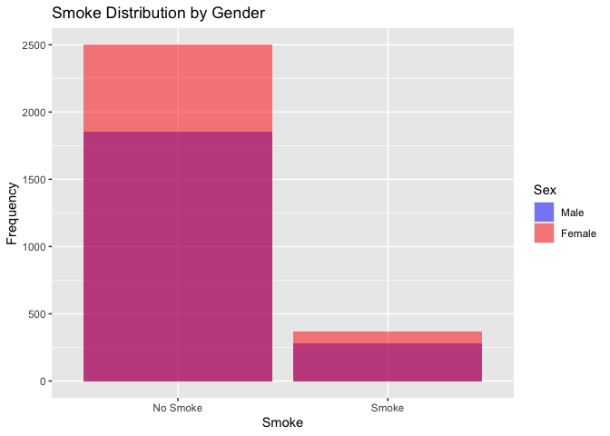
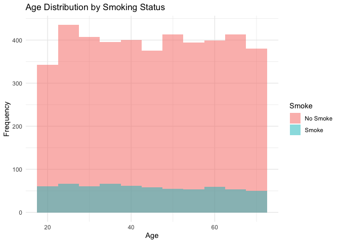
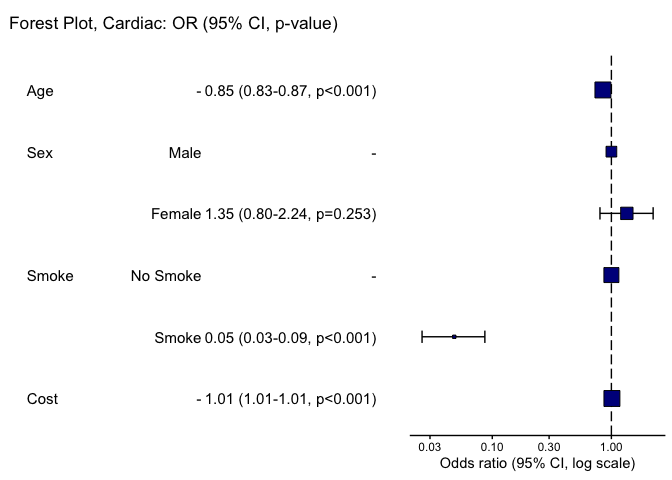

# Assignment2_DataAnalysis


## Project Summary & Instructions

EPI 203 Assignment 2. This project involves analyzing a synthetic
dataset with any prediction model.

### Instructions

Create a short R analysis of the cohort simulated data in a repository
on your GitHub account. Fork the repository and then edit to add your
analysis in a new branch. The analysis should include at least one table
describing the variables, a prediction algorithm (e.g., glm function,
caret package, etc.), at least one figure, and a brief summary of your
findings in the README.

## Data Cleaning

Data set: synthetic data

The csv file for `cohort` in the `raw-data` folder includes 5,000
observations with variables `smoke`, `female`, `age`, `cardiac`, and
`cost`.

``` r
library(tidyverse)
```

    ── Attaching core tidyverse packages ──────────────────────── tidyverse 2.0.0 ──
    ✔ dplyr     1.2.1     ✔ readr     2.2.0
    ✔ forcats   1.0.1     ✔ stringr   1.6.0
    ✔ ggplot2   4.0.2     ✔ tibble    3.3.1
    ✔ lubridate 1.9.5     ✔ tidyr     1.3.2
    ✔ purrr     1.2.2     
    ── Conflicts ────────────────────────────────────────── tidyverse_conflicts() ──
    ✖ dplyr::filter() masks stats::filter()
    ✖ dplyr::lag()    masks stats::lag()
    ℹ Use the conflicted package (<http://conflicted.r-lib.org/>) to force all conflicts to become errors

``` r
library(here)
```

    here() starts at /Users/tracychidyausiku/Coursework/epi/epi203/Assignment2

``` r
# load dataset
synthetic_df <- read_csv("/Users/tracychidyausiku/Coursework/epi/epi203/Assignment2/raw-data/cohort.csv")
```

    Rows: 5000 Columns: 5
    ── Column specification ────────────────────────────────────────────────────────
    Delimiter: ","
    dbl (5): smoke, female, age, cardiac, cost

    ℹ Use `spec()` to retrieve the full column specification for this data.
    ℹ Specify the column types or set `show_col_types = FALSE` to quiet this message.

``` r
head(synthetic_df)
```

    # A tibble: 6 × 5
      smoke female   age cardiac  cost
      <dbl>  <dbl> <dbl>   <dbl> <dbl>
    1     0      1    49       0  9542
    2     0      1    40       0  8849
    3     0      1    48       0  9233
    4     0      0    44       0  9507
    5     0      1    25       0  8585
    6     0      0    39       0  9507

``` r
# check for any missingness
sum(is.na(synthetic_df))
```

    [1] 0

``` r
# visualize distribution of continuous variables
hist(synthetic_df$age)
```


``` r
hist(synthetic_df$cost)
```


## Table 1

Purpose: Create a table with numeric description of variables

Binary Variables: female, cardiac, smoke

Continuous Variables: age, cost

``` r
library(table1)
```


    Attaching package: 'table1'

    The following objects are masked from 'package:base':

        units, units<-

``` r
library(kableExtra)
```


    Attaching package: 'kableExtra'

    The following object is masked from 'package:dplyr':

        group_rows

``` r
# Make binary variables factors
synthetic_df$female <- factor(synthetic_df$female, levels=c(0,1), labels=c("Male", "Female"))
synthetic_df$smoke <- factor(synthetic_df$smoke, levels=c(0,1), labels=c("No Smoke", "Smoke"))
synthetic_df$cardiac <- factor(synthetic_df$cardiac, levels=c(0,1), labels=c("No Cardiac", "Cardiac"))

# Create table labels
label(synthetic_df$female) <- "Sex"
label(synthetic_df$smoke) <- "Smoke"
label(synthetic_df$cost) <- "Cost"
label(synthetic_df$age) <- "Age"

# create table 1
tableOne <- table1(~ cost + age + female + smoke | cardiac, data = synthetic_df)

# Save as PNG
save_kable(tableOne, file = "table1.png")
```

    file:////private/var/folders/mp/8xpl7rjn447555j2nxmc56640000gn/T/Rtmp9Fuii7/table1aaad1b3e3f08.html screenshot completed

    save_kable will have the best result with magick installed. 

## Data Analysis

Question: Does cost influence the risk for a cardiac event?

Exposure: cost

Outcome: cardiac (occurs in ~5% of the population)

Covariates: female, smoke, age

Model: Logistic Regression

``` r
# model: logistic regression
logistic_reg <- glm(cardiac ~ cost + female + smoke + age, data = synthetic_df, family = "binomial")

summary(logistic_reg)
```


    Call:
    glm(formula = cardiac ~ cost + female + smoke + age, family = "binomial", 
        data = synthetic_df)

    Coefficients:
                   Estimate Std. Error z value Pr(>|z|)    
    (Intercept)  -9.472e+01  4.954e+00 -19.119   <2e-16 ***
    cost          1.023e-02  5.442e-04  18.808   <2e-16 ***
    femaleFemale  2.989e-01  2.615e-01   1.143    0.253    
    smokeSmoke   -3.037e+00  3.094e-01  -9.815   <2e-16 ***
    age          -1.637e-01  1.101e-02 -14.875   <2e-16 ***
    ---
    Signif. codes:  0 '***' 0.001 '**' 0.01 '*' 0.05 '.' 0.1 ' ' 1

    (Dispersion parameter for binomial family taken to be 1)

        Null deviance: 2129.82  on 4999  degrees of freedom
    Residual deviance:  782.31  on 4995  degrees of freedom
    AIC: 792.31

    Number of Fisher Scoring iterations: 8

``` r
# OR (CI) table
results <- exp(cbind(OR = coef(logistic_reg), confint(logistic_reg)))
```

    Waiting for profiling to be done...

``` r
# Save ORs (CI) as a dataframe
logistc_reg_OR_CI <- as.data.frame(results)
```

## 

## Figures

``` r
library(ggplot2)

table(synthetic_df$female, synthetic_df$smoke)
```

            
             No Smoke Smoke
      Male       1855   279
      Female     2499   367

``` r
# smoker by female/male
ggplot(synthetic_df, aes(x = smoke, fill = female)) +
  geom_bar(alpha = 0.5, position = "identity", bins = 30) +
  scale_fill_manual(values = c("Female" = "red", "Male" = "blue")) +
  labs(title = "Smoke Distribution by Gender",
       x = "Smoke",
       y = "Frequency")
```

    Warning in geom_bar(alpha = 0.5, position = "identity", bins = 30): Ignoring
    unknown parameters: `bins`



``` r
# smoker by age
ggplot(synthetic_df, aes(x=age, fill=smoke)) +
  geom_histogram(binwidth=5, position="identity", alpha=0.5) +
  labs(title="Age Distribution by Smoking Status",
       x="Age",
       y="Frequency") +
  theme_minimal()
```



### Forest Plot

``` r
library(finalfit)

explanatory = c("age", "female", "smoke", "cost")
dependent = 'cardiac'
synthetic_df %>% or_plot(dependent, explanatory, 
                         dependent_label = "Forest Plot, Cardiac")
```

    Waiting for profiling to be done...
    Waiting for profiling to be done...
    Waiting for profiling to be done...

    `height` was translated to `width`.


